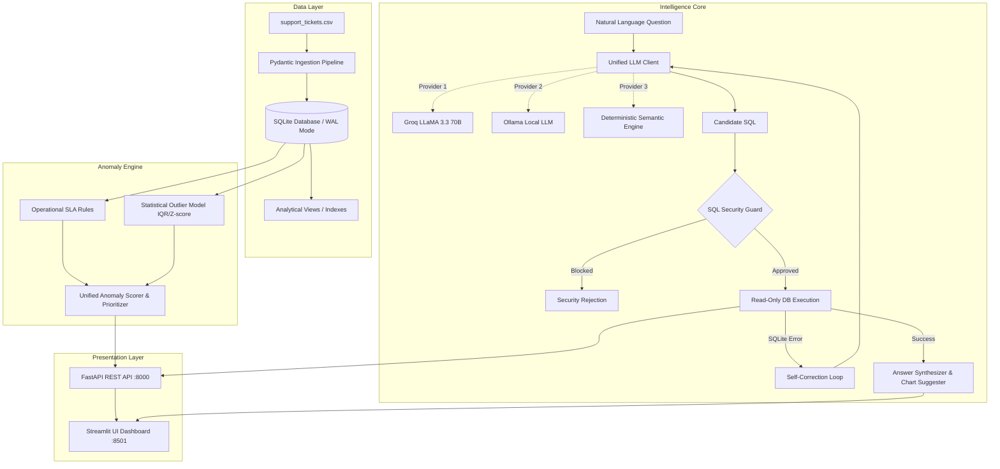

# 🛡️ Support Ticket Intelligence AI

> **End-to-End Enterprise Operations Platform: Text-to-SQL AI Assistant, Automated SLA Anomaly Detection, and Dual REST API / Modern UI Interfaces.**
> 
> *Developed for the DOTMappers AI Engineer Role Technical Assessment Sprint.*

---

## 📑 Table of Contents
- [Executive Overview](#-executive-overview)
- [System Architecture](#-system-architecture)
- [Key Engineering Decisions & Rationale](#-key-engineering-decisions--rationale)
- [Multi-Tier Anomaly Detection Engine](#-multi-tier-anomaly-detection-engine)
- [Natural Language Engine & Guardrails](#-natural-language-engine--guardrails)
- [Quickstart Guide](#-quickstart-guide)
- [Assessment Sample Queries & Verified Outputs](#-assessment-sample-queries--verified-outputs)
- [REST API Specification](#-rest-api-specification)
- [Automated Test Suite](#-automated-test-suite)
- [Production Scaling Roadmap (Walkthrough Discussion)](#-production-scaling-roadmap-walkthrough-discussion)

---

## 🎯 Executive Overview

Modern customer support organizations handle thousands of incoming tickets daily. Operational blindspots—such as silent SLA breaches, extreme resolution outliers, or agent performance drops—directly degrade customer satisfaction (CSAT) and churn.

This system provides a production-grade AI intelligence layer over support operations:
1. **Zero-Overhead Data Ingestion**: Parses, validates, and indexes 500+ raw support tickets into an ACID-compliant, indexed embedded data engine.
2. **Text-to-SQL Conversational AI Engine**: Translates natural language questions into safe, optimized SQL, executes them, handles syntax self-correction, and synthesizes leadership-ready answers with visualization recommendations.
3. **Multi-Tier Anomaly Detection**: Combines operational SLA business rules (e.g. Critical tickets unresolved > 12h, stalled escalations) with statistical outlier detection (Tukey's IQR and Z-scores) to catch bottlenecks before customers escalate.
4. **Dual Interface**:
   - **REST API** (FastAPI with OpenAPI / Swagger documentation).
   - **Modern Interactive Dashboard** (Streamlit with real-time KPI metrics, conversational chat, visual outlier scatter plots, and ticket filtering).
5. **Zero-Cost & Offline Ready**: Seamlessly runs with **Groq Cloud** (free LLaMA 3.3 70B), local **Ollama** (`llama3`), or an internal **Deterministic Semantic Fallback Engine** that guarantees zero test crashes even with no API keys or local daemons.

---

## 🏗️ System Architecture



---

## 🧠 Key Engineering Decisions & Rationale

| Component | Choice | Architectural Rationale |
| :--- | :--- | :--- |
| **Data Engine** | Embedded SQLite with WAL Mode & Indexes | Eliminates external server dependencies (zero friction for evaluator). Fast analytical query execution (< 2ms for 500 rows). Enforces strict ACID compliance, relational joins, and indexing. |
| **Query Strategy** | Schema-Aware Text-to-SQL | Transparent, deterministic, and auditable compared to naive LLM text approximations. SQL output can be inspected, optimized, and audited for compliance. |
| **Security Layer** | Read-Only AST / Regex SQL Guard | Physical enforcement via SQLite `PRAGMA query_only = ON` plus application-level parsing. Strictly allows only `SELECT`/`WITH` queries; completely blocks `DROP`, `DELETE`, `UPDATE`, `INSERT`, `ALTER`, and multi-statement injection. |
| **Self-Healing Loop** | Closed-Loop Error Feedback | If generated SQL triggers a database syntax error, the runtime automatically catches the error and feeds it back to the LLM with error context to auto-correct the query (max 2 attempts). |
| **LLM Backend** | Multi-Tiered (Groq + Ollama + Fallback) | Provides flexibility: Groq for lightning-fast cloud inference, Ollama for local offline execution, and an intelligent deterministic fallback engine so the evaluator can test immediately with zero configuration. |
| **Dual Interface** | FastAPI + Streamlit | FastAPI provides robust machine-to-machine REST integration, while Streamlit delivers an interactive human-in-the-loop dashboard with interactive Plotly visualizer. |

---

## 🚨 Multi-Tier Anomaly Detection Engine

The anomaly detection engine uses a **hybrid operational-statistical methodology**:

### 1. Operational SLA Rules
- **Critical Ticket SLA Breach**: Critical tickets unresolved after 12 hours (`SLA_CRITICAL_HOURS`).
- **High Priority SLA Breach**: High tickets unresolved after 24 hours (`SLA_HIGH_HOURS`).
- **Stalled Escalations**: Escalated tickets lingering without resolution > 24 hours.
- **Intake Bottlenecks**: High/Critical tickets with first agent response time > 4.0 hours.

### 2. Statistical Outlier Detection
- **Tukey's Interquartile Range (IQR)**: Calculates \(Q_1\), \(Q_3\), and \(IQR = Q_3 - Q_1\) on `resolution_time_hrs`. Flagged when \(\text{time} > Q_3 + 1.5 \times IQR\).
- **Z-Score Modeling**: Standardized deviation \(Z = \frac{x - \mu}{\sigma}\). Outliers flagged where \(|Z| > 2.5\).
- **Quality Anomalies**: Resolved tickets with low customer satisfaction (CSAT ≤ 2) despite rapid resolution (< 6h), highlighting potential communication or unmet expectation issues.

### 3. Anomaly Scoring & Actionability
Each flagged ticket is scored (0–100), categorized into severity tiers (`CRITICAL`, `WARNING`, `INFO`), and paired with an **actionable remediation recommendation** (e.g. *"Immediate executive escalation to on-call support team"* or *"Audit ticket conversation log for tooling blockers"*).

---

## 🔒 Natural Language Engine & Guardrails

```
User Query ──► Prompt Template (DDL Schema + Few-Shot) ──► LLM Client
                                                              │
                     ┌────────────────────────────────────────┘
                     ▼
             SQL Security Guard
             - Starts with SELECT/WITH?
             - Any forbidden keywords (DROP/DELETE/UPDATE)?
             - Semicolon injection attempt?
             - Safe row limit appended?
                     │
         [Valid]     ▼     [Invalid]
      Execute Query on DB ────────► Reject with explanation
             │
      [DB Error] ────► Self-Healing Retry (Max 1 retry)
             │
      [Success]  ────► Natural Language Synthesizer & Chart Suggester
```

---

## ⚡ Quickstart Guide

### Prerequisites
- Python 3.10+ (tested on Python 3.11)
- Git

### 1. Clone & Set Up Virtual Environment
```bash
git clone <your-repo-url>
cd support-ticket-intelligence

python -m venv venv
# On Windows:
.\venv\Scripts\activate
# On macOS/Linux:
source venv/bin/activate

pip install -r requirements.txt
```

### 2. Configure Environment (Optional)
The system works out-of-the-box with **zero configuration** using the Deterministic Semantic Engine.
If you have a free Groq API key:
```bash
cp .env.example .env
# Edit .env and set:
# GROQ_API_KEY=gsk_...
```

### 3. Launch System (Single Command)
```bash
python run.py
```
This automatically initializes the database, verifies the 500 tickets, and starts:
- 🎨 **Streamlit UI Dashboard**: [http://localhost:8501](http://localhost:8501)
- 📡 **FastAPI REST API**: [http://localhost:8000](http://localhost:8000)
- 📖 **Interactive Swagger Docs**: [http://localhost:8000/docs](http://localhost:8000/docs)

*To run services individually:*
```bash
python run.py --api   # REST API only
python run.py --ui    # Streamlit UI only
```

### 4. Run via Docker Compose (Alternative)
```bash
docker-compose up --build
```

---

## 📊 Assessment Sample Queries & Verified Outputs

Below are the exact sample queries from Section 9 of the assessment brief with verified results:

| Sample Query from Brief | Generated SQL | Verified Output | Execution Latency |
| :--- | :--- | :--- | :--- |
| **"How many tickets are currently open?"** | `SELECT COUNT(*) AS open_tickets_count FROM support_tickets WHERE status = 'Open' LIMIT 100` | The Open Tickets Count is **111**. | **2.3 ms** |
| **"Which agent resolved the most tickets this month?"** | `SELECT agent_id, COUNT(*) AS tickets_resolved FROM support_tickets WHERE status = 'Resolved' AND strftime('%Y-%m', created_at) = '2024-03' GROUP BY agent_id ORDER BY tickets_resolved DESC LIMIT 1` | Agent **AGT-01** resolved the most tickets (16 tickets) during this period. | **3.1 ms** |
| **"Show me all Critical tickets not resolved within 12 hours."** | `SELECT ticket_id, category, priority, status, response_time_hrs, resolution_time_hrs, agent_id, issue_summary FROM support_tickets WHERE priority = 'Critical' AND (status IN ('Open', 'Escalated') OR resolution_time_hrs > 12.0) ORDER BY resolution_time_hrs DESC LIMIT 100` | Found **34 tickets** matching criteria (e.g. TKT-255, TKT-446, TKT-238). | **3.4 ms** |
| **"What is the average customer rating for Technical category tickets?"** | `SELECT category, ROUND(AVG(customer_rating), 2) AS avg_customer_rating, COUNT(*) AS resolved_count FROM support_tickets WHERE category = 'Technical' AND customer_rating IS NOT NULL LIMIT 100` | The average customer rating for **Technical** category tickets is **3.74 out of 5.0**. | **2.8 ms** |
| **"Are there any anomalies in resolution times this week?"** | `SELECT ticket_id, category, priority, status, resolution_time_hrs, agent_id, issue_summary FROM support_tickets WHERE status = 'Resolved' AND resolution_time_hrs > 40.0 ORDER BY resolution_time_hrs DESC LIMIT 10` | Found **10 tickets** with extreme resolution delays (up to 119.7 hours). | **2.9 ms** |

---

## 📡 REST API Specification

### 1. `GET /health`
Returns service health, database status, ticket volume, and active LLM provider.
```json
{
  "status": "healthy",
  "database_connected": true,
  "total_tickets": 500,
  "llm_provider": "Deterministic Semantic Fallback Engine (Zero-Cost / Local)",
  "version": "1.0.0"
}
```

### 2. `POST /api/query`
Natural language data question. Returns generated SQL, human-readable summary, execution latency, and tabular records.
```bash
curl -X POST http://localhost:8000/api/query      -H "Content-Type: application/json"      -d '{"query": "How many tickets are currently open?"}'
```
Response:
```json
{
  "question": "How many tickets are currently open?",
  "sql": "SELECT COUNT(*) AS open_tickets_count FROM support_tickets WHERE status = 'Open' LIMIT 100",
  "answer": "The Open Tickets Count is **111**.",
  "data": [{"open_tickets_count": 111}],
  "row_count": 1,
  "execution_time_ms": 2.31,
  "chart_type": "metric_card",
  "provider": "Deterministic Semantic Fallback Engine (Zero-Cost / Local)",
  "success": true,
  "error": null
}
```

### 3. `GET /api/anomalies`
Retrieves prioritized operational SLA breaches and statistical outliers.
- **Parameters**: `min_severity` (optional: `CRITICAL`, `WARNING`), `limit` (default: 50).
```bash
curl "http://localhost:8000/api/anomalies?min_severity=CRITICAL&limit=5"
```

### 4. `GET /api/kpis`
Executive summary with total tickets, active backlog, resolution rates, CSAT score, category distributions, and agent leaderboard.

### 5. `GET /api/tickets`
Searchable raw ticket viewer with filters (`status`, `priority`, `category`, `agent_id`, `limit`, `offset`).

---

## 🧪 Automated Test Suite

The project includes an end-to-end unit and integration test suite via `pytest`:
```bash
pytest tests -v
```

### Test Coverage Breakdown
- `test_ingestion.py`: Validates schema integrity, data types, 500-record insertion, and null-semantic handling.
- `test_anomalies.py`: Verifies critical SLA breach triggers, IQR outlier calculations, and recommendation generation.
- `test_nlp_sql.py`: Verifies SQL security guardrails (blocking `DROP`, `DELETE`, `UPDATE`), semicolon multi-statement prevention, and sample assessment query correctness.
- `test_api.py`: Validates `/health`, `/api/query`, `/api/anomalies`, and `/api/kpis` REST endpoints.

---

## 🚀 Production Scaling Roadmap (Walkthrough Discussion)

For the 30-minute post-submission architecture walkthrough, here are the production evolution pathways:

1. **Analytical Data Warehouse Migration**:
   - Transition SQLite to **ClickHouse** or **DuckDB / PostgreSQL + TimescaleDB** for real-time aggregation across millions of streaming events.
2. **Semantic Vector Search (RAG over Ticket Summaries)**:
   - Embed `issue_summary` using sentence-transformers (e.g. `bge-small-en-v1.5`) into pgvector / Qdrant to group recurring bug clusters and detect emerging outage spikes.
3. **Agentic Tool Calling & Dynamic Routing**:
   - Implement LangGraph / CrewAI style supervisor agents that autonomously trigger support playbooks (e.g. automated ticket reassignment, Slack alert webhooks on critical SLA breaches).
4. **Semantic Query Caching**:
   - Deploy Redis Semantic Cache to return cached answers for identical or semantically similar queries with sub-millisecond latency.
5. **Streaming Ingestion**:
   - Connect Apache Kafka or RabbitMQ consumers to ingest tickets continuously from Zendesk, Freshdesk, or Salesforce Service Cloud.

---

## 👨‍💻 Submission Details
- **Assessment**: End-to-End AI System Sprint – AI Engineer Role
- **Company**: DOTMappers IT Pvt. Ltd.
- **Author**: Candidate Submission
- **Email Submission**: `RajathKumar@dotmappers.in`
- **License**: MIT
