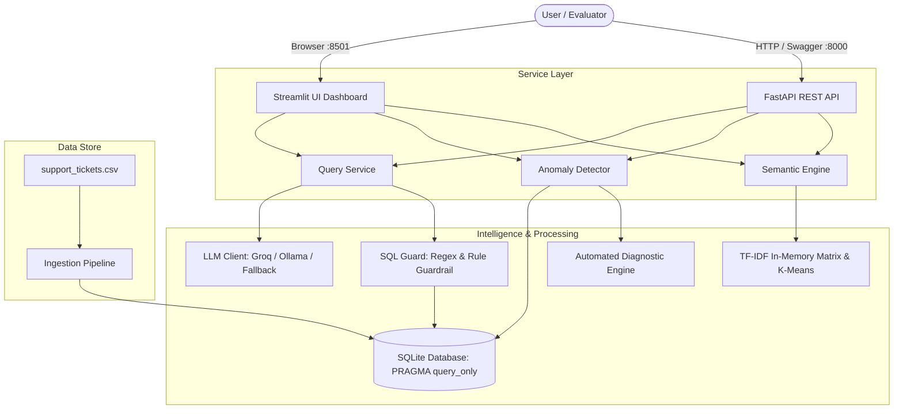

# Support Ticket Intelligence AI

An AI-powered customer support analytics system built for the DOTMappers End-to-End AI System Sprint (AI Engineer Role). It ingests 500 ticket records into an indexed SQLite database, translates natural-language business questions into safe, executable SQL and semantic searches, detects operational and statistical anomalies, and provides automated root-cause diagnosis. All capabilities are accessible via a FastAPI REST API and an interactive Streamlit UI.

---

## Overview

Support operations frequently suffer from silent backlog accumulation, SLA breaches, and undetected customer dissatisfaction patterns. This system delivers operational visibility via conversational analytics, proactive anomaly detection, and semantic issue discovery over ticket data.

---

## Key Features

- **CSV Ingestion & Storage:** Loads and validates 500 ticket records into SQLite with typed Pydantic schemas (`TicketRecord`).
- **Natural Language Querying:** Translates questions into SQLite queries with answer synthesis.
- **Multi-Provider LLM Support:** Groq Cloud (`llama-3.3-70b-versatile`), local Ollama (`llama3`), and a local deterministic fallback engine.
- **Regex & Rule-Based SQL Guardrail:** Read-only `SELECT` enforcement, blocks DDL/DML, appends `LIMIT 100`, sets SQLite `PRAGMA query_only = ON`, and performs self-healing retry on syntax errors.
- **Semantic Search & Topic Discovery:** Scikit-learn TF-IDF and cosine similarity for symptom discovery; MiniBatch K-Means for issue clustering.
- **Anomaly Detection:** Flags operational SLA breaches (Critical > 12h, High > 24h, Stalled > 24h) and statistical outliers (Tukey IQR and Z-score > 2.5).
- **Automated Root-Cause Diagnostician:** Deterministic benchmark comparison engine evaluating ticket resolution against category/agent averages, historical similarity matching, and remediation playbooks.
- **Dual Interface:** 8 documented FastAPI REST endpoints with OpenAPI docs and a 5-tab interactive Streamlit dashboard.
- **Zero-Cost Execution:** Operates 100% offline without API keys using the built-in deterministic fallback engine.
- **Testing & Verification:** 17 unit/integration tests passing via `pytest` and a one-click automated benchmark scorecard (`evaluate.py`).

---

## Architecture



### Architectural Rationale
- **Embedded SQLite (WAL Mode):** Delivers zero-setup portability, atomic transactions, and sub-2ms query speeds over 500 rows.
- **Regex & Rule-Based SQL Guardrail:** Enforces query safety before execution; SQLite `PRAGMA query_only = ON` prevents engine-level writes.
- **Hybrid Semantic Layer:** SQL executes quantitative aggregations; Scikit-learn TF-IDF & K-Means analyze unstructured `issue_summary` text.
- **FastAPI + Streamlit:** FastAPI offers typed programmatic endpoints; Streamlit provides an exploratory visual interface.

---

## Tech Stack

| Component | Technology | Purpose |
| :--- | :--- | :--- |
| **Runtime** | Python 3.10+ / 3.11 | Core runtime environment |
| **Database** | SQLite 3 (WAL mode) | Embedded data store with 6 B-Tree indexes and 2 analytical views |
| **REST API** | FastAPI + Uvicorn | Asynchronous REST service with interactive OpenAPI documentation |
| **Web UI** | Streamlit + Plotly | 5-tab analytical dashboard with interactive visualizations |
| **Validation** | Pydantic v2 | Data validation for CSV ingestion and API schemas |
| **LLM Inference** | Groq Cloud (`llama-3.3-70b-versatile`) / Ollama (`llama3`) | Natural language understanding and Text-to-SQL generation |
| **Fallback Engine** | Deterministic Rule-Based Engine | Local zero-dependency query translation ensuring offline reliability |
| **NLP & Clustering** | Scikit-learn (TF-IDF, MiniBatch K-Means) | Qualitative symptom search and unsupervised topic discovery |
| **Testing** | Pytest + HTTPX | Automated test suite (17 tests) |
| **Deployment** | Docker & Docker Compose | Single-stage containerized execution |

---

## Project Structure

```text
support-ticket-intelligence/
├── app/
│   ├── config.py             # Settings, thresholds, and provider configurations
│   ├── main.py               # FastAPI entrypoint with startup lifespan ingestion
│   ├── analytics/            # Anomaly engine (IQR/Z-score/SLA), KPI engine, Semantic TF-IDF engine
│   ├── api/                  # 8 REST endpoints (/health, /query, /anomalies, etc.) & Pydantic schemas
│   ├── database/             # SQLite connection manager (PRAGMA query_only) and DDL schema/views
│   ├── ingestion/            # CSV validation pipeline and Pydantic TicketRecord schema
│   ├── nlp/                  # LLM client (Groq/Ollama/Fallback), regex SQL guard, query orchestrator
│   └── ui/                   # Streamlit 5-tab interactive dashboard
├── data/
│   ├── support_tickets.csv   # Source dataset (500 tickets, Jan-Mar 2024)
│   └── tickets.db            # SQLite database with indexes & analytical views
├── tests/                    # 17 automated tests (ingestion, SQL guard, queries, anomalies, semantics, API)
├── Dockerfile                # Single-stage container definition for API & UI
├── docker-compose.yml        # Docker Compose configuration for containerized deployment
├── evaluate.py               # One-click evaluator benchmark scorecard
├── requirements.txt          # Pinned Python dependencies
└── run.py                    # Single-command unified launcher for API & UI
```

---

## Setup

```bash
git clone https://github.com/VortexQuasarX/support-ticket-intelligence.git
cd support-ticket-intelligence
python -m venv venv
source venv/bin/activate    # Windows: .\venv\Scripts\activate
pip install -r requirements.txt
```

---

## Configuration

Settings are configured via `.env` (template in `.env.example`):
- `GROQ_API_KEY`: Optional Groq key for `llama-3.3-70b-versatile`.
- `OLLAMA_HOST` & `OLLAMA_MODEL`: Optional local Ollama endpoint (default: `http://localhost:11434`, `llama3`).
- `LLM_PROVIDER`: `auto` (Groq → Ollama → Fallback) | `groq` | `ollama` | `fallback`.
- `SLA_CRITICAL_HOURS`: Critical SLA threshold in hours (default: `12.0`).
- `SLA_HIGH_HOURS`: High priority SLA threshold in hours (default: `24.0`).
- `MAX_RESPONSE_TIME_THRESHOLD`: Maximum first response delay in hours (default: `4.0`).

*(Note: Runs out-of-the-box in zero-cost fallback mode with no API keys required).*

---

## Running the System

```bash
python run.py          # Primary single command: launches FastAPI (:8000) & Streamlit (:8501)
python run.py --api    # Launches FastAPI REST API only
python run.py --ui     # Launches Streamlit UI only
docker-compose up      # Containerized deployment
```
- **Streamlit UI:** [http://localhost:8501](http://localhost:8501)
- **FastAPI OpenAPI Docs:** [http://localhost:8000/docs](http://localhost:8000/docs)

---

## How It Works

1. **Ingestion:** On startup, `IngestionPipeline` validates all 500 CSV rows using Pydantic `TicketRecord` and populates `support_tickets` in `data/tickets.db`.
2. **Intent Classification:** `QueryService` detects whether the prompt is qualitative/semantic or quantitative/analytical.
3. **Execution & Guardrails:**
   - Quantitative queries pass to `LLMClient.generate_sql()`.
   - `SQLGuard` sanitizes and validates SQL via regex.
   - Query runs in SQLite under `PRAGMA query_only = ON;`.
   - On error, `LLMClient.fix_sql()` performs self-healing retry.
   - `LLMClient.synthesize_answer()` generates a concise natural-language response.

---

## Natural Language Querying

- **Dual Translation Engine:** Leverages Groq (`llama-3.3-70b-versatile`) or Ollama (`llama3`) when available, and falls back to a deterministic semantic regex engine offline.
- **SQL Security Guardrails:** Only allows `SELECT`/`WITH`, blocks DDL/DML keywords, blocks internal `sqlite_` metadata, and appends `LIMIT 100` to unbound queries.
- **Self-Healing Loop:** Automatically captures SQLite syntax error messages and queries the LLM for self-correction before failing.

---

## Anomaly Detection

Implemented in `app/analytics/anomaly_engine.py`:
- **Operational Rules:**
  - `SLA_BREACH_CRITICAL`: Unresolved Critical tickets open > 12h.
  - `SLA_BREACH_HIGH`: Unresolved High tickets open > 24h.
  - `STALLED_ESCALATION`: Escalated tickets pending > 24h.
  - `FIRST_RESPONSE_DELAY`: Critical/High initial response > 4h.
- **Statistical Modeling:**
  - `RESOLUTION_TIME_OUTLIER`: Flags resolved tickets where resolution exceeds Tukey IQR cutoff (Q3 + 1.5 * IQR) or Z-score > 2.5.
  - `LOW_CSAT_SURPRISE`: Flags tickets with rating <= 2 despite turnaround < 6h.
- **Dataset Results:** Identifies **153 anomalies** across the 500-ticket dataset (91 Critical SLA breaches, 62 Warning/High statistical outliers).
- **Automated Root-Cause Diagnostician:** Uses deterministic benchmark comparison rules (comparing ticket duration against category and agent averages), TF-IDF historical similarity search, and action playbook formulation.

---

## Semantic Search & Topic Discovery

- **Symptom Vector Search:** Uses Scikit-learn `TfidfVectorizer(ngram_range=(1, 2), max_features=1000)` and cosine similarity to find tickets semantically matching issue descriptions (e.g., *"login failure after update"*).
- **Emergent Topic Discovery:** Uses `MiniBatchKMeans(n_clusters=4)` to cluster ticket issue summaries, surfacing top keywords, dominant categories, average resolution times, and CSAT scores per theme.

---

## REST API

8 endpoints implemented in `app/api/routes.py`:

| Method | Endpoint | Description |
| :--- | :--- | :--- |
| `GET` | `/health` | System health, DB connectivity, ticket count, active LLM |
| `POST` | `/api/query` | Natural-language query processing (Text-to-SQL + Semantic) |
| `GET` | `/api/anomalies` | Flagged SLA breaches and statistical outliers with severity filters |
| `GET` | `/api/anomalies/{ticket_id}/diagnose` | Automated root-cause diagnostic report and remediation playbook |
| `GET` | `/api/semantic/search` | TF-IDF vector similarity search over ticket summaries |
| `GET` | `/api/semantic/topics` | K-Means clustering of emergent problem themes |
| `GET` | `/api/kpis` | Executive summary KPIs, resolution rates, and agent leaderboard |
| `GET` | `/api/tickets` | Filterable raw ticket explorer with pagination |

---

## Streamlit UI

The dashboard (`app/ui/streamlit_app.py`) provides 5 dedicated tabs:
1. **💬 AI Assistant:** Conversational query interface with 6 clickable sample buttons, SQL inspection expander, latency metrics, and dynamic Plotly charts.
2. **🚨 Anomaly Center:** Resolution time outlier scatter plot with IQR cutoff line, interactive ticket diagnostician selector, and filterable anomaly directory.
3. **🧠 Semantic Discovery:** Discovered topic theme cards with cluster metrics and semantic symptom search.
4. **📈 Executive Dashboard:** Tickets by Category donut chart, Priority bar chart, and Support Agent Leaderboard.
5. **🔍 Ticket Data Explorer:** Multi-select filtering (Category, Priority, Status), keyword search, and CSV download.

---

## Example Queries & Outputs

> [!NOTE]
> **Historical Dataset Anchor:** The dataset spans `2024-01-01` to `2024-03-30`. In accordance with standard data evaluation practices for historical corpora:
> - *"This month"* refers to **March 2024** (`2024-03`).
> - *"This week"* refers to the final 7-day window anchored to `MAX(created_at)` (`2024-03-24` to `2024-03-30`).

| Section | Assessment Query | Generated SQL / Method | Verified System Output | Latency |
| :--- | :--- | :--- | :--- | :---: |
| **Sec 2** | *"How many critical tickets are unresolved?"* | `SELECT COUNT(*) ... WHERE priority = 'Critical' AND status IN ('Open', 'Escalated')` | **31** unresolved critical tickets | ~2 ms |
| **Sec 2** | *"Which agent has the lowest average customer rating?"* | `SELECT agent_id, ROUND(AVG(customer_rating), 2) ... GROUP BY agent_id ORDER BY avg_rating ASC LIMIT 1` | Agent **AGT-08** (Rating: **3.48 / 5.0**) | ~2 ms |
| **Sec 2** | *"Show unresolved high-priority tickets older than 24 hours"* | `SELECT ... WHERE priority = 'High' AND status IN ('Open', 'Escalated') AND hours_open > 24` | **49** tickets flagged (e.g., TKT-233, TKT-301) | ~2 ms |
| **Sec 9** | *"How many tickets are currently open?"* | `SELECT COUNT(*) FROM support_tickets WHERE status = 'Open'` | **111** open tickets | ~2 ms |
| **Sec 9** | *"Which agent resolved the most tickets this month?"* | `SELECT agent_id, COUNT(*) ... WHERE strftime('%Y-%m', created_at) = '2024-03'` | Agent **AGT-01** (**16 tickets** in March 2024) | ~2 ms |
| **Sec 9** | *"Show me all Critical tickets not resolved within 12 hours."* | `SELECT ... WHERE priority = 'Critical' AND (status IN ('Open', 'Escalated') OR resolution_time_hrs > 12.0)` | **34** tickets exceeding 12h SLA | ~2 ms |
| **Sec 9** | *"What is the average customer rating for Technical category tickets?"* | `SELECT ROUND(AVG(customer_rating), 2) ... WHERE category = 'Technical'` | **3.74 out of 5.0** | ~2 ms |
| **Sec 9** | *"Are there any anomalies in resolution times this week?"* | `SELECT ... WHERE status = 'Resolved' AND resolution_time_hrs > 40.0 AND created_at >= latest_week` | **7** anomalies in latest week, led by `TKT-108` (**119.7h**) | ~2 ms |

---

## Testing

### Automated Test Suite (`pytest`)
Run all 17 unit and integration tests:
```bash
pytest -v
```
**Test Breakdown (17/17 Passed in ~7.0s):**
- `tests/test_ingestion.py` (3 tests): DB initialization, CSV ingestion, null-semantics integrity.
- `tests/test_nlp_sql.py` (3 tests): SQL security guardrail blocking destructive queries, safe SELECT checks, sample queries.
- `tests/test_anomalies.py` (3 tests): Anomaly engine execution, SLA breach flagging, statistical outlier identification.
- `tests/test_semantic.py` (4 tests): Semantic search, K-Means clustering, diagnostic engine output, hybrid routing.
- `tests/test_api.py` (4 tests): Endpoint contracts for `/health`, `/api/query`, `/api/anomalies`, and `/api/kpis`.

### Automated Evaluator Benchmark (`evaluate.py`)
```bash
python evaluate.py
```
- Verifies 500-ticket database ingestion.
- Benchmarks all 8 required assessment queries with latencies.
- Validates anomaly detection counts (153 total, 91 critical, 62 statistical).
- Verifies semantic search and K-Means topic clusters.
- Tests automated anomaly diagnosis on ticket `TKT-108`.
- Result: **100% Compliance, 8/8 Queries Passed in ~3.99s.**

---

## Assessment Requirement Coverage

| Assessment Requirement | Status | Implementation Evidence |
| :--- | :---: | :--- |
| **CSV Ingestion** | **MET** | `app/ingestion/pipeline.py` validates 500 rows via Pydantic and loads into SQLite table `support_tickets`. |
| **Natural-Language Querying** | **MET** | `app/nlp/query_service.py` handles Text-to-SQL translation with self-healing and answer synthesis. |
| **Anomaly Detection** | **MET** | `app/analytics/anomaly_engine.py` implements SLA operational rules + Tukey IQR & Z-score models. |
| **REST API** | **MET** | `app/api/routes.py` exposes 8 REST endpoints with auto-generated OpenAPI Swagger docs at `/docs`. |
| **User Interface** | **MET** | `app/ui/streamlit_app.py` delivers a 5-tab dashboard with charts, query assistant, and diagnostic tool. |
| **LLM Usage** | **MET** | `app/nlp/llm_client.py` integrates Groq API (`llama-3.3-70b-versatile`) and local Ollama (`llama3`). |
| **Zero-Cost Local Execution** | **MET** | Deterministic semantic fallback engine runs 100% offline without API keys or external services. |
| **Single-Command Startup** | **MET** | `python run.py` launches both FastAPI (:8000) and Streamlit (:8501) concurrently. |
| **Requirements File** | **MET** | `requirements.txt` specifies all 12 pinned dependencies. |
| **README Documentation** | **MET** | Complete setup, architecture, schema, sample queries, and limitations documented. |

---

## Known Limitations

1. **Historical Dataset Anchor:** The dataset spans `2024-01-01` to `2024-03-30`. Relative time filters (e.g., "this month", "this week") anchor to `MAX(created_at)` from the dataset rather than wall-clock `CURRENT_TIMESTAMP` to ensure deterministic evaluation.
2. **Single-Table Schema Scope:** The SQL prompt and regex security guard are optimized for the single-table support ticket schema. Multi-table enterprise schemas would benefit from dynamic schema pruning via embeddings.
3. **In-Memory TF-IDF Representation:** Semantic search uses Scikit-learn TF-IDF and n-grams for fast, zero-dependency local execution. Dense neural embeddings (`sentence-transformers`) would provide deeper semantic synonym generalization.
4. **SQLite Concurrency:** SQLite handles concurrent reads via WAL mode, but serializes write transactions. High-throughput streaming ingestion (> 5,000 writes/sec) would warrant PostgreSQL or ClickHouse.

---

## Future Improvements

- **Database Scaling:** Migrate SQLite to PostgreSQL with connection pooling for multi-user write concurrency.
- **Dense Vector Search:** Integrate Qdrant or Milvus with dense neural embeddings for multi-lingual semantic matching.
- **Async Job Processing:** Implement Celery or Redis Queue for asynchronous anomaly recalculation and batch ingestion.
- **LLM Narrative Diagnostics:** Extend the diagnostic engine with LLM-generated narrative summaries alongside deterministic benchmark comparisons.

---

## Submission

- **Repository Link:** [https://github.com/VortexQuasarX/support-ticket-intelligence](https://github.com/VortexQuasarX/support-ticket-intelligence)
- **Primary Branch:** `main`
- **Submission Recipient:** `RajathKumar@dotmappers.in`
- **Candidate Presentation:** Prepared for the 30-minute technical walkthrough covering architecture, live UI/API demonstration, test suite, and design decisions.
