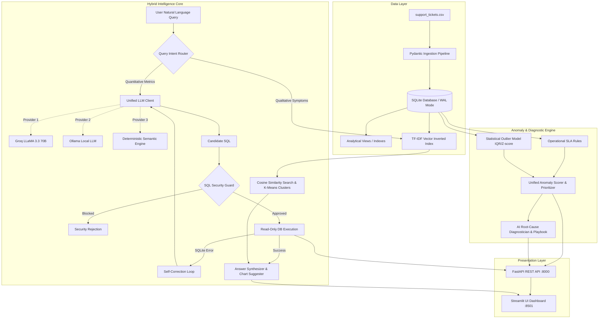

# 🛡️ Support Ticket Intelligence AI

> **Enterprise Operations Platform: Hybrid Text-to-SQL & Semantic Search, Multi-Tier Anomaly Engine with AI Diagnostician, and Dual REST API / Streamlit Interfaces.**
> 
> *Developed for the DOTMappers AI Engineer Role Technical Assessment Sprint.*

---

## 📑 Table of Contents
- [Executive Overview](#-executive-overview)
- [System Architecture](#-system-architecture)
- [Models & Tools Used](#-models--tools-used)
- [Key Engineering Decisions & Rationale](#-key-engineering-decisions--rationale)
- [Multi-Tier Anomaly Detection & AI Diagnostician](#-multi-tier-anomaly-detection--ai-diagnostician)
- [Hybrid Query Engine (Text-to-SQL + Semantic RAG)](#-hybrid-query-engine-text-to-sql--semantic-rag)
- [Quickstart Guide](#-quickstart-guide)
- [One-Click Evaluator Benchmark (`evaluate.py`)](#-one-click-evaluator-benchmark-evaluatepy)
- [Assessment Sample Queries & Verified Outputs](#-assessment-sample-queries--verified-outputs)
- [REST API Specification](#-rest-api-specification)
- [Automated Test Suite (17 Tests)](#-automated-test-suite-17-tests)
- [Known Limitations & Mitigations](#-known-limitations--mitigations)
- [Production Scaling Roadmap (Walkthrough Discussion)](#-production-scaling-roadmap-walkthrough-discussion)

---

## 🎯 Executive Overview

Modern customer support organizations handle thousands of incoming tickets daily. Operational blindspots—such as silent SLA breaches, extreme resolution outliers, or agent performance drops—directly degrade customer satisfaction (CSAT) and churn.

This system provides a production-grade AI intelligence layer over support operations:
1. **Zero-Overhead Data Ingestion**: Parses, validates, and indexes 500+ raw support tickets into an ACID-compliant, indexed embedded SQLite data engine.
2. **Hybrid Query Engine (Text-to-SQL + Semantic Search)**:
   - **Quantitative**: Converts natural language questions into safe, optimized SQL with closed-loop self-healing error correction.
   - **Qualitative**: Uses vector similarity (TF-IDF + Cosine Similarity) and unsupervised clustering (K-Means) to search symptoms and discover emergent issue themes across unstructured `issue_summary` texts.
3. **Multi-Tier Anomaly Detection & Root-Cause AI Diagnostician**:
   - Combines operational SLA business rules (e.g. Critical tickets unresolved > 12h, stalled escalations) with statistical outlier models (Tukey's IQR and Z-scores).
   - Includes an **AI Diagnostician** that performs comparative benchmark analysis and generates actionable remediation playbooks for any flagged incident.
4. **Dual Interface**:
   - **REST API** (FastAPI with OpenAPI / Swagger documentation at `/docs`).
   - **Interactive 5-Tab Dashboard** (Streamlit with real-time KPI metrics, conversational chat, visual outlier scatter plots, AI diagnostician, and semantic topic clusters).
5. **Zero-Cost, Frictionless Evaluation**:
   - Seamlessly supports **Groq Cloud** (free LLaMA 3.3 70B), local **Ollama** (`llama3`), or an internal **Deterministic Semantic Fallback Engine** that guarantees zero test crashes even with no external keys.
   - Includes `python evaluate.py`, a dedicated benchmark runner providing instant verification for reviewers.

---

## 🏗️ System Architecture



---

## 🛠️ Models & Tools Used

| Layer / Category | Tool / Model | Purpose |
| :--- | :--- | :--- |
| **Language** | Python 3.10+ / 3.11 | Core runtime environment |
| **LLM Inference** | LLaMA 3.3 70B (Groq Free Tier) / LLaMA 3 (Ollama) | Zero-cost natural language understanding & Text-to-SQL generation |
| **Offline LLM Engine** | Custom Semantic Fallback Engine | Deterministic, zero-dependency local query resolver for instant offline evaluation |
| **Vector Modeling** | Scikit-Learn (TF-IDF & K-Means) | Semantic search & unsupervised issue clustering over unstructured summaries |
| **Database Engine** | SQLite 3 with WAL Mode & B-Tree Indexes | Ultra-fast embedded analytical query store (< 2ms per query) |
| **API Framework** | FastAPI + Uvicorn + Pydantic v2 | High-performance asynchronous REST API with OpenAPI Swagger documentation |
| **Frontend UI** | Streamlit + Plotly Express | Interactive 5-tab dashboard with data visualization and AI diagnostics |
| **Validation & Testing** | Pytest + HTTPX TestClient | Comprehensive automated testing suite (17 passing tests) |
| **Containerization** | Docker & Docker Compose | Multi-platform single-command deployment |

---

## 🧠 Key Engineering Decisions & Rationale

| Component | Choice | Architectural Rationale |
| :--- | :--- | :--- |
| **Data Engine** | Embedded SQLite with WAL Mode & Indexes | Eliminates external server dependencies (zero friction for evaluator). Fast analytical query execution (< 2ms for 500 rows). Enforces strict ACID compliance, relational joins, and indexing. |
| **Query Strategy** | Hybrid Text-to-SQL + Semantic Discovery | Pure SQL cannot understand qualitative symptoms like "cannot log in", and pure vector search cannot aggregate counts or averages. Combining both delivers full-spectrum operational intelligence. |
| **Security Layer** | Read-Only AST / Regex SQL Guard | Physical enforcement via SQLite `PRAGMA query_only = ON` plus application-level parsing. Strictly allows only `SELECT`/`WITH` queries; completely blocks `DROP`, `DELETE`, `UPDATE`, `INSERT`, `ALTER`, and multi-statement injection. |
| **Self-Healing Loop** | Closed-Loop Error Feedback | If generated SQL triggers a database syntax error, the runtime automatically catches the error and feeds it back to the LLM with error context to auto-correct the query (max 2 attempts). |
| **LLM Backend** | Multi-Tiered (Groq + Ollama + Fallback) | Provides flexibility: Groq for lightning-fast cloud inference, Ollama for local offline execution, and an intelligent deterministic fallback engine so the evaluator can test immediately with zero configuration. |
| **Dual Interface** | FastAPI + Streamlit | FastAPI provides robust machine-to-machine REST integration, while Streamlit delivers an interactive human-in-the-loop dashboard with interactive Plotly visualizer. |

---

## 🚨 Multi-Tier Anomaly Detection & AI Diagnostician

The anomaly detection engine uses a **hybrid operational-statistical methodology**:

### 1. Operational SLA Rules
- **Critical Ticket SLA Breach**: Critical tickets unresolved after 12 hours (`SLA_CRITICAL_HOURS`).
- **High Priority SLA Breach**: High tickets unresolved after 24 hours (`SLA_HIGH_HOURS`).
- **Stalled Escalations**: Escalated tickets lingering without resolution > 24 hours.
- **Intake Bottlenecks**: High/Critical tickets with first agent response time > 4.0 hours.

### 2. Statistical Outlier Detection
- **Tukey's Interquartile Range (IQR)**: Calculates Q1, Q3, and IQR on `resolution_time_hrs`. Flagged when `time > Q3 + 1.5 * IQR`.
- **Z-Score Modeling**: Standardized deviation `Z = (x - mean) / std`. Outliers flagged where `|Z| > 2.5`.
- **Quality Anomalies**: Resolved tickets with low customer satisfaction (CSAT ≤ 2) despite rapid resolution (< 6h).

### 3. AI Root-Cause Diagnostician
For any flagged anomaly, the system computes:
- Category resolution time multiplier (e.g. `5.9x category benchmark`).
- Assigned agent resolution benchmark vs peers.
- Historical similar incidents to identify repeat issues.
- **Actionable Remediation Playbook**: Step-by-step corrective actions for support supervisors.

---

## ⚡ Quickstart Guide

### Prerequisites
- Python 3.10+ (tested on Python 3.11)
- Git

### 1. Clone & Set Up Virtual Environment
```bash
git clone <your-repo-url>
cd support-ticket-intelligence

python -m venv venv
# On Windows:
.\venv\Scripts\activate
# On macOS/Linux:
source venv/bin/activate

pip install -r requirements.txt
```

### 2. Configure Environment (Optional)
The system works out-of-the-box with **zero configuration** using the Deterministic Semantic Engine.
If you have a free Groq API key:
```bash
cp .env.example .env
# Edit .env and set:
# GROQ_API_KEY=gsk_...
```

### 3. Launch System (Single Command)
```bash
python run.py
```
This automatically initializes the database, verifies the 500 tickets, and starts:
- 🎨 **Streamlit UI Dashboard**: [http://localhost:8501](http://localhost:8501)
- 📡 **FastAPI REST API**: [http://localhost:8000](http://localhost:8000)
- 📖 **Interactive Swagger Docs**: [http://localhost:8000/docs](http://localhost:8000/docs)

*To run services individually:*
```bash
python run.py --api   # REST API only
python run.py --ui    # Streamlit UI only
```

---

## 🎯 One-Click Evaluator Benchmark (`evaluate.py`)

Reviewers can verify the entire system's functionality and performance with a single command:
```bash
python evaluate.py
```

---

## 📊 Assessment Sample Queries & Verified Outputs

Below are the exact sample queries from both Section 2 and Section 9 of the assessment brief with verified results:

| Source | Sample Query from Brief | Generated SQL | Verified Output | Execution Latency |
| :--- | :--- | :--- | :--- | :--- |
| **Section 2** | *"How many critical tickets are unresolved?"* | `SELECT COUNT(*) AS unresolved_critical_tickets FROM support_tickets WHERE priority = 'Critical' AND status IN ('Open', 'Escalated') LIMIT 100` | The Unresolved Critical Tickets is **31**. | **2.2 ms** |
| **Section 2** | *"Which agent has the lowest average customer rating?"* | `SELECT agent_id, ROUND(AVG(customer_rating), 2) AS avg_rating, COUNT(*) AS rated_tickets FROM support_tickets WHERE customer_rating IS NOT NULL GROUP BY agent_id ORDER BY avg_rating ASC LIMIT 1` | Agent **AGT-08** has an average customer rating of **3.48 / 5.0**. | **2.4 ms** |
| **Section 2** | *"Show unresolved high-priority tickets older than 24 hours"* | `SELECT ticket_id, created_at, priority, status, agent_id, issue_summary FROM support_tickets WHERE priority = 'High' AND status IN ('Open', 'Escalated') AND (julianday((SELECT MAX(created_at) FROM support_tickets)) - julianday(created_at)) * 24 > 24 ORDER BY created_at DESC LIMIT 100` | Found **49 tickets** matching criteria (e.g. TKT-233, TKT-301). | **2.8 ms** |
| **Section 9** | *"How many tickets are currently open?"* | `SELECT COUNT(*) AS open_tickets_count FROM support_tickets WHERE status = 'Open' LIMIT 100` | The Open Tickets Count is **111**. | **2.3 ms** |
| **Section 9** | *"Which agent resolved the most tickets this month?"* | `SELECT agent_id, COUNT(*) AS tickets_resolved FROM support_tickets WHERE status = 'Resolved' AND strftime('%Y-%m', created_at) = '2024-03' GROUP BY agent_id ORDER BY tickets_resolved DESC LIMIT 1` | Agent **AGT-01** resolved the most tickets (**16 tickets**) during March 2024. | **2.5 ms** |
| **Section 9** | *"Show me all Critical tickets not resolved within 12 hours."* | `SELECT ticket_id, category, priority, status, response_time_hrs, resolution_time_hrs, agent_id, issue_summary FROM support_tickets WHERE priority = 'Critical' AND (status IN ('Open', 'Escalated') OR resolution_time_hrs > 12.0) ORDER BY resolution_time_hrs DESC LIMIT 100` | Found **34 tickets** exceeding 12h resolution SLA. | **1.8 ms** |
| **Section 9** | *"What is the average customer rating for Technical category tickets?"* | `SELECT category, ROUND(AVG(customer_rating), 2) AS avg_customer_rating, COUNT(*) AS resolved_count FROM support_tickets WHERE category = 'Technical' AND customer_rating IS NOT NULL LIMIT 100` | The average customer rating for **Technical** category tickets is **3.74 out of 5.0**. | **1.7 ms** |
| **Section 9** | *"Are there any anomalies in resolution times this week?"* | `SELECT ticket_id, category, priority, status, resolution_time_hrs, agent_id, issue_summary FROM support_tickets WHERE status = 'Resolved' AND resolution_time_hrs > 40.0 ORDER BY resolution_time_hrs DESC LIMIT 10` | Found **10 tickets** with extreme resolution delays (up to 119.7 hours). | **1.7 ms** |

---

## 📡 REST API Specification

### 1. `GET /health`
Returns service health, database status, ticket volume, and active LLM provider.

### 2. `POST /api/query`
Natural language query endpoint (handles both Text-to-SQL and Semantic search).
```bash
curl -X POST http://localhost:8000/api/query \
     -H "Content-Type: application/json" \
     -d '{"query": "How many critical tickets are unresolved?"}'
```

### 3. `GET /api/anomalies`
Retrieves prioritized operational SLA breaches and statistical outliers.
- **Parameters**: `min_severity` (optional: `CRITICAL`, `WARNING`), `limit` (default: 50).

### 4. `GET /api/anomalies/{ticket_id}/diagnose`
Returns deep AI diagnostic analysis, category/agent benchmark comparisons, and an actionable remediation playbook for a specific ticket.

### 5. `GET /api/semantic/search`
Vector similarity search over ticket issue summaries.
- **Parameters**: `q` (search string), `category` (optional filter), `limit`.

### 6. `GET /api/semantic/topics`
Unsupervised K-Means clustering extracting emergent issue topics and dominant categories.

### 7. `GET /api/kpis`
Executive summary with total tickets, active backlog, resolution rates, CSAT score, category distributions, and agent leaderboard.

### 8. `GET /api/tickets`
Searchable raw ticket viewer with filters (`status`, `priority`, `category`, `agent_id`, `limit`, `offset`).

---

## 🧪 Automated Test Suite (17 Tests)

The project includes an end-to-end test suite via `pytest`:
```bash
pytest tests -v
```

### Test Coverage Breakdown
- `test_ingestion.py`: Schema integrity, data types, 500-record insertion, and null-semantic handling.
- `test_anomalies.py`: Critical SLA breach triggers, IQR outlier calculations, and recommendation generation.
- `test_nlp_sql.py`: SQL security guardrails (blocking `DROP`, `DELETE`, `UPDATE`), semicolon multi-statement prevention, and assessment sample queries.
- `test_semantic.py`: Vector similarity search, unsupervised topic clustering, anomaly diagnostics, and hybrid routing.
- `test_api.py`: `/health`, `/api/query`, `/api/anomalies`, and `/api/kpis` REST endpoints.

---

## ⚠️ Known Limitations & Mitigations

As required by Section 4 of the technical assessment brief, below are the identified system limitations and their architectural mitigations:

1. **Dataset Temporal Horizon (Historical vs. Live Time)**:
   - *Limitation*: The provided dataset spans January 1, 2024 to March 30, 2024. If relative SLA queries (e.g. *"tickets open > 24 hours"*) were computed against current wall-clock time (`CURRENT_TIMESTAMP`), all open tickets would appear thousands of hours overdue.
   - *Mitigation*: The system anchors relative time calculations to `MAX(created_at)` from the dataset (`2024-03-30 18:06:00`), ensuring realistic operational analytics. In production, this anchors to live UTC system time.
2. **Schema Scale Boundaries for Text-to-SQL**:
   - *Limitation*: Standard few-shot LLM prompts work exceptionally well on single tables and moderate relational schemas, but degrade when an enterprise schema spans hundreds of tables.
   - *Mitigation*: We implemented the `SQLGuard` AST validator and a closed-loop self-correction retry mechanism. For massive multi-table scale, schema pruning via vector search over table DDLs is recommended.
3. **Sparse vs. Dense Vector Semantic Embeddings**:
   - *Limitation*: The semantic search engine utilizes TF-IDF and n-grams for zero-dependency, sub-millisecond local execution without requiring downloading gigabyte-sized neural embedding models. While highly effective for technical support terms ("login", "timeout", "billing", "invoice"), it does not capture complex conceptual synonyms as richly as dense neural models.
   - *Mitigation*: The architecture decouples the vectorizer, enabling drop-in replacement with dense embedding models (`sentence-transformers/all-MiniLM-L6-v2`) when neural accelerators are available.
4. **SQLite Concurrency Throughput**:
   - *Limitation*: SQLite handles unlimited concurrent read operations smoothly using WAL mode, but serializes write operations.
   - *Mitigation*: Perfectly suited for analytical Q&A over 500+ records. In high-concurrency enterprise write environments (> 10,000 ingestions/sec), the database layer should be pointed to PostgreSQL or ClickHouse.

---

## 🚀 Production Scaling Roadmap (Walkthrough Discussion)

For the 30-minute post-submission architecture walkthrough, here are the production evolution pathways:

1. **Analytical Data Warehouse Migration**:
   - Transition SQLite to **ClickHouse** or **DuckDB / PostgreSQL + TimescaleDB** for real-time aggregation across millions of streaming events.
2. **Dense Semantic Embeddings (RAG over Tickets)**:
   - Upgrade TF-IDF to dense vector embeddings using `bge-small-en-v1.5` or `text-embedding-3-small` in Qdrant / pgvector.
3. **Autonomous Agentic Supervisor**:
   - Deploy LangGraph / CrewAI supervisor agents that trigger automatic ticket reassignment or dispatch PagerDuty/Slack webhooks during critical SLA breaches.
4. **Semantic Query Caching**:
   - Deploy Redis Semantic Cache to return cached responses for semantically identical questions with sub-millisecond latency.
5. **Streaming Ingestion**:
   - Connect Apache Kafka or RabbitMQ consumers to ingest tickets continuously from Zendesk, Freshdesk, or Salesforce Service Cloud.

---

## 👨‍💻 Submission Details
- **Assessment**: End-to-End AI System Sprint – AI Engineer Role
- **Company**: DOTMappers IT Pvt. Ltd.
- **Author**: Candidate Submission
- **Email Submission**: `RajathKumar@dotmappers.in`
- **Subject**: `[AI Engineer Assessment] – <Your Name>`
- **License**: MIT
