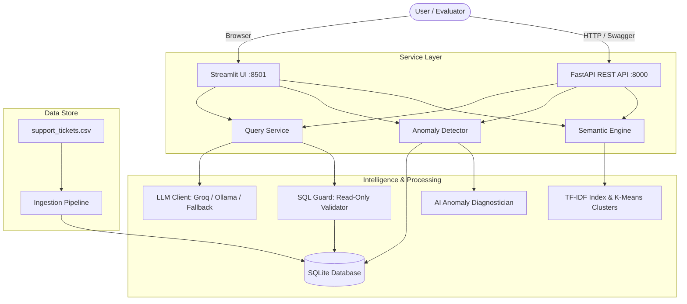

# Support Ticket Intelligence AI

An AI-powered customer support analytics system built for technical evaluation. It ingests 500 customer support ticket records into a queryable SQLite database, translates natural-language business questions into safe, executable SQL and semantic searches, automatically detects operational and statistical anomalies, and provides AI-assisted root-cause diagnosis. All capabilities are exposed through both a FastAPI REST API and an interactive Streamlit UI dashboard.

*Built for: DOTMappers IT Pvt. Ltd. — End-to-End AI System Sprint (AI Engineer Role)*

---

## Overview

Customer support teams handle high ticket volumes where SLA breaches, response delays, and customer dissatisfaction often go unnoticed until escalations occur. This system provides visibility into support operations through conversational analytics and proactive anomaly detection.

**System Workflows:**
- **Natural-Language Querying:** `CSV` → Data Ingestion → SQLite Database → Natural-Language Query → LLM / Query Processing → Text-to-SQL or Semantic Search → Formatted Answer & Chart
- **Anomaly Detection:** Ticket Data → Operational SLA Rules + Statistical Models (IQR & Z-Score) → Flagged Tickets → AI Root-Cause Diagnosis & Remediation Playbook

---

## Key Features

- **CSV Ingestion & Storage:** Validates and loads 500 ticket records into an indexed SQLite database using Pydantic schemas.
- **Natural-Language Querying:** Translates English business questions into SQLite queries with answer synthesis.
- **LLM Integration:** Multi-provider support for Groq Cloud (`llama-3.3-70b-versatile`), local Ollama (`llama3`), and a local deterministic fallback engine.
- **SQL Safety & Self-Healing:** Enforces read-only `SELECT` statements via AST/regex parsing, blocks DDL/DML, physically locks writes via SQLite `PRAGMA query_only = ON`, and auto-corrects syntax errors via error feedback.
- **Semantic Search & Topic Discovery:** Uses TF-IDF and cosine similarity for qualitative symptom search, and MiniBatch K-Means to cluster tickets into emergent issue themes.
- **Anomaly Detection & AI Diagnosis:** Flags operational SLA breaches (Critical > 12h, High > 24h) and statistical outliers (Tukey's IQR & Z-score), providing comparative benchmarks and remediation playbooks.
- **Dual Interface:** Full FastAPI REST API (8 endpoints with OpenAPI Swagger docs) and an interactive 5-tab Streamlit dashboard.
- **Zero-Cost & Local Execution:** Operates with zero paid API dependencies; includes an offline fallback engine ensuring the evaluator never faces broken runs.
- **Testing & Deployment:** 17 unit/integration tests passing via `pytest`, one-click evaluator benchmark (`evaluate.py`), and containerized via Docker.

---

## Architecture



### Architectural Rationale
- **Embedded SQLite (WAL Mode):** Eliminates external database infrastructure, guarantees zero setup friction for evaluators, and delivers sub-2ms analytical query speed over 500 rows.
- **Text-to-SQL + AST Guard:** SQL produces deterministic, transparent, and auditable arithmetic for quantitative metrics, while the security guard prevents destructive queries.
- **Hybrid Semantic Layer:** While SQL handles quantitative aggregations, TF-IDF and K-Means handle unstructured text in `issue_summary` for symptom search and cluster discovery.
- **FastAPI + Streamlit:** FastAPI provides typed, asynchronous, machine-to-machine REST endpoints, while Streamlit delivers an interactive human-in-the-loop dashboard.

---

## Tech Stack

| Component | Technology | Purpose |
| :--- | :--- | :--- |
| **Language** | Python 3.10+ / 3.11 | Core runtime environment |
| **Database** | SQLite 3 (WAL mode) | Embedded data store with B-tree indexes and analytical views |
| **REST API** | FastAPI + Uvicorn | Asynchronous web service with automatic OpenAPI documentation |
| **Web UI** | Streamlit + Plotly | 5-tab interactive analytics dashboard with charts |
| **Data Validation** | Pydantic v2 | Schema validation for ingestion and API request/response models |
| **LLM Inference** | Groq API (`llama-3.3-70b-versatile`) / Ollama (`llama3`) | Natural language understanding and Text-to-SQL generation |
| **Local Fallback Engine** | Custom Semantic Rule Engine | Zero-dependency local query resolver for instant offline evaluation |
| **NLP & Clustering** | Scikit-learn (TF-IDF, K-Means) | Qualitative symptom search and unsupervised topic discovery |
| **Testing** | Pytest + HTTPX | Automated test suite (17 tests) |
| **Deployment** | Docker & Docker Compose | Containerized single-command execution |

---

## Project Structure

```text
support-ticket-intelligence/
├── app/
│   ├── config.py             # Settings, thresholds, and provider configurations
│   ├── main.py               # FastAPI entrypoint with startup lifecycle
│   ├── analytics/            # Anomaly engine (IQR/Z-score/SLA), KPI engine, Semantic TF-IDF engine
│   ├── api/                  # FastAPI routes (/health, /query, /anomalies, /semantic) & Pydantic schemas
│   ├── database/             # SQLite connection manager (PRAGMA query_only) and DDL schema/views
│   ├── ingestion/            # CSV validation pipeline and Pydantic TicketRecord schema
│   ├── nlp/                  # LLM client (Groq/Ollama/Fallback), SQL guard, prompt templates, query router
│   └── ui/                   # Streamlit 5-tab executive dashboard
├── data/
│   ├── support_tickets.csv   # Source dataset (500 tickets)
│   └── tickets.db            # SQLite database with indexes & views
├── tests/                    # 17 automated tests (anomalies, API, ingestion, NLP/SQL guard, semantic)
├── Dockerfile                # Multi-stage container definition
├── docker-compose.yml        # Compose configuration for API and UI
├── evaluate.py               # One-click evaluator benchmark scorecard
├── requirements.txt          # Pinned Python dependencies
└── run.py                    # Single-command launcher for API & UI
```

---

## Quickstart Guide

### 1. Setup Environment
```bash
git clone <repo-url>
cd support-ticket-intelligence
python -m venv venv
source venv/bin/activate    # On Windows: .\venv\Scripts\activate
pip install -r requirements.txt
```
*(Optional: add `GROQ_API_KEY=gsk_...` to `.env` to enable Groq Cloud LLaMA 3.3 70B; otherwise runs offline fallback at zero cost).*

### 2. Run Evaluator Benchmark & Tests
```bash
python evaluate.py          # One-click benchmark scorecard (< 5 seconds)
pytest tests -v             # Run all 17 automated unit and integration tests
```

### 3. Launch System (Single Command)
Launches both FastAPI and Streamlit concurrently:
```bash
python run.py
```
- **Streamlit UI Dashboard:** [http://localhost:8501](http://localhost:8501)
- **FastAPI REST API & Docs:** [http://localhost:8000/docs](http://localhost:8000/docs)
*(Alternative: `docker-compose up`)*

---

## REST API Endpoints

| Method | Endpoint | Description | Example Query / Body |
| :--- | :--- | :--- | :--- |
| `GET` | `/health` | System status, DB connectivity, ticket count, active LLM | `curl http://localhost:8000/health` |
| `POST` | `/api/query` | Natural-language query (Text-to-SQL + Semantic) | `{"query": "How many tickets are currently open?"}` |
| `GET` | `/api/anomalies` | Flagged SLA breaches and statistical outliers | `curl "http://localhost:8000/api/anomalies?limit=10"` |
| `GET` | `/api/anomalies/{id}/diagnose` | AI root-cause diagnosis & remediation playbook | `curl http://localhost:8000/api/anomalies/TKT-108/diagnose` |
| `GET` | `/api/semantic/search` | Vector similarity search over ticket summaries | `curl "http://localhost:8000/api/semantic/search?q=login+failure"` |
| `GET` | `/api/semantic/topics` | K-Means clustering of emergent problem themes | `curl http://localhost:8000/api/semantic/topics?n_clusters=4` |
| `GET` | `/api/kpis` | Executive summary (CSAT, resolution rates, agent stats) | `curl http://localhost:8000/api/kpis` |
| `GET` | `/api/tickets` | Filterable ticket explorer (status, priority, category) | `curl "http://localhost:8000/api/tickets?priority=Critical"` |

---

## Sample Queries & Verified Outputs

Below are the verified outputs for the queries specified in the assessment brief:

| Section | Query | Generated SQL / Method | Verified System Output | Latency |
| :--- | :--- | :--- | :--- | :---: |
| **Sec 2** | *"How many critical tickets are unresolved?"* | `SELECT COUNT(*) ... WHERE priority = 'Critical' AND status IN ('Open', 'Escalated')` | **31** unresolved critical tickets | ~2 ms |
| **Sec 2** | *"Which agent has the lowest average customer rating?"* | `SELECT agent_id, ROUND(AVG(customer_rating), 2) ... GROUP BY agent_id ORDER BY avg_rating ASC LIMIT 1` | Agent **AGT-08** (Rating: **3.48 / 5.0**) | ~2 ms |
| **Sec 2** | *"Show unresolved high-priority tickets older than 24 hours"* | `SELECT ... WHERE priority = 'High' AND status IN ('Open', 'Escalated') AND elapsed > 24` | **49** tickets flagged (e.g., TKT-233, TKT-301) | ~2 ms |
| **Sec 9** | *"How many tickets are currently open?"* | `SELECT COUNT(*) FROM support_tickets WHERE status = 'Open'` | **111** open tickets | ~2 ms |
| **Sec 9** | *"Which agent resolved the most tickets this month?"* | `SELECT agent_id, COUNT(*) ... WHERE strftime('%Y-%m', created_at) = '2024-03'` | Agent **AGT-01** (**16 tickets** in March 2024) | ~2 ms |
| **Sec 9** | *"Show me all Critical tickets not resolved within 12 hours."* | `SELECT ... WHERE priority = 'Critical' AND (status IN ('Open', 'Escalated') OR resolution_time_hrs > 12.0)` | **34** tickets exceeding 12h SLA | ~2 ms |
| **Sec 9** | *"What is the average customer rating for Technical category tickets?"* | `SELECT ROUND(AVG(customer_rating), 2) ... WHERE category = 'Technical'` | **3.74 out of 5.0** | ~2 ms |
| **Sec 9** | *"Are there any anomalies in resolution times this week?"* | `SELECT ... WHERE status = 'Resolved' AND resolution_time_hrs > 40.0 AND created_at >= latest_week` | **7** anomalies in latest week, led by `TKT-108` (**119.7h**) | ~2 ms |

---

## Known Limitations & Mitigations

1. **Historical Dataset Anchor:** The dataset spans `2024-01-01` to `2024-03-30`. Relative time filters (e.g., "older than 24 hours", "this week") anchor to `MAX(created_at)` from the dataset rather than wall-clock `CURRENT_TIMESTAMP` to ensure deterministic evaluation. In a live system, this connects to UTC system time.
2. **Single-Table Schema Scope:** The Text-to-SQL prompt and security guard are tuned for the support ticket schema. Scaling to enterprise schemas with dozens of tables would require dynamic schema pruning via vector search.
3. **Sparse vs. Dense Embeddings:** Semantic search utilizes TF-IDF and n-grams for fast, zero-dependency local execution. While effective for support terminology, dense neural embeddings (`sentence-transformers`) would provide richer conceptual synonym matching.
4. **SQLite Write Concurrency:** SQLite handles concurrent reads via WAL mode, but serializes writes. Suitable for analytical prototypes, but high-throughput ingestion (> 5,000 writes/sec) would warrant PostgreSQL or ClickHouse.
